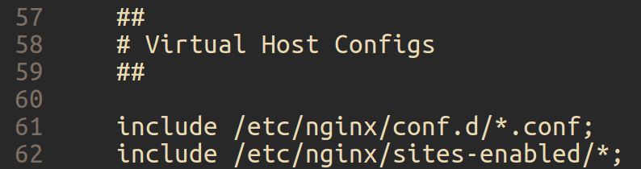
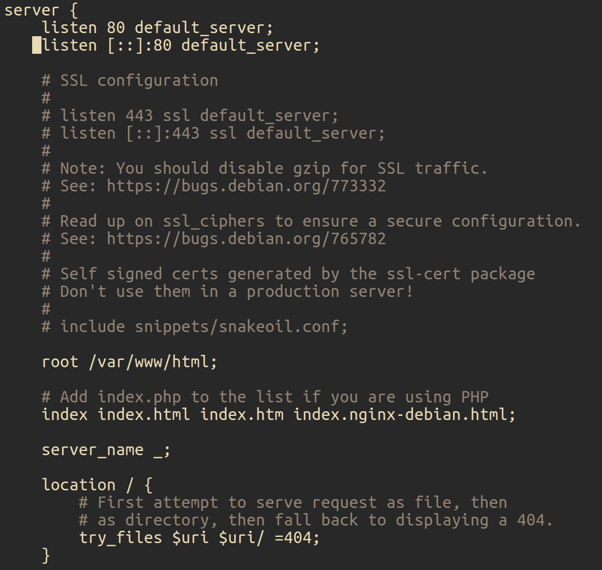

# 碰到的一些小问题
## pymongo
1. 注意数据类型的转换
2. 注意数据的更新

## nginx
1. 首先利用`sudo nginx -t`查看nginx配置文件位置
nginx: the configuration file /etc/nginx/nginx.conf syntax is ok
nginx: configuration file /etc/nginx/nginx.conf test is successful
2. 进入该文件直接加上代理的代码段，发现提示不能直接加在此处
3. 仔细阅读 nginx.conf
4. 
发现有包含其他文件，于是在/etc/nginx/conf.d/目录下建立helloworld.conf，填好配置
5. 再运行没有报错，但是还是不能实现重定向(404)，这个时候发现文件夹下有一个default文件

就是此文件实现了404报错功能。
将之移至别处，实现重定向
